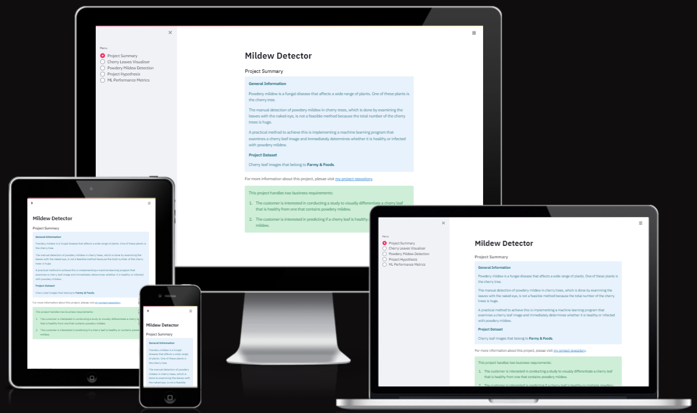
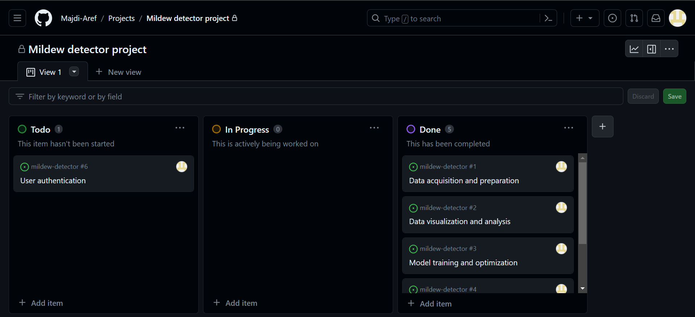
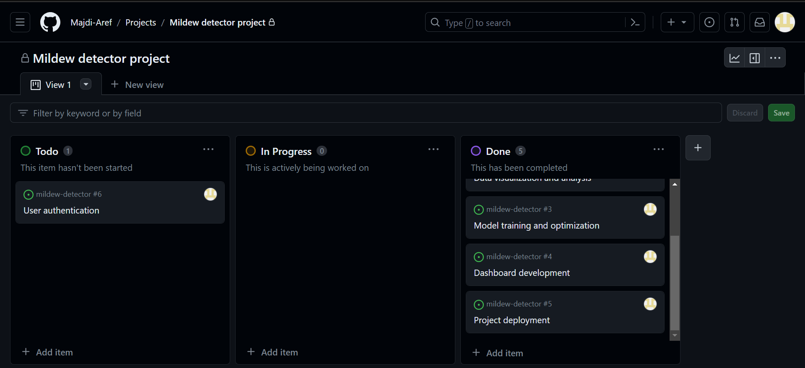
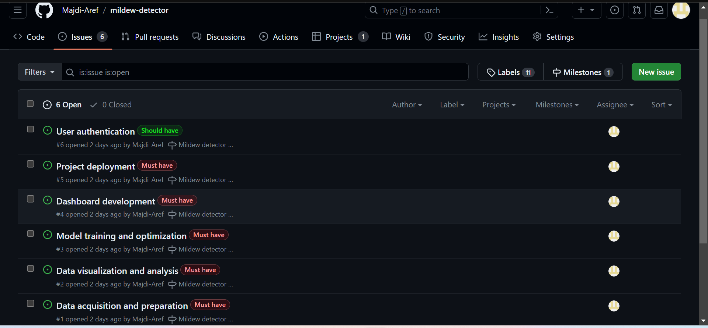
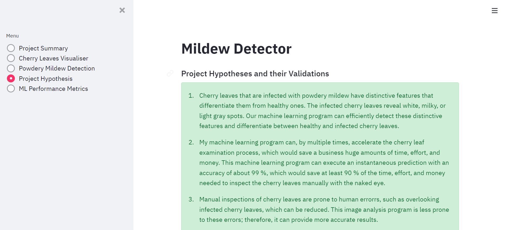
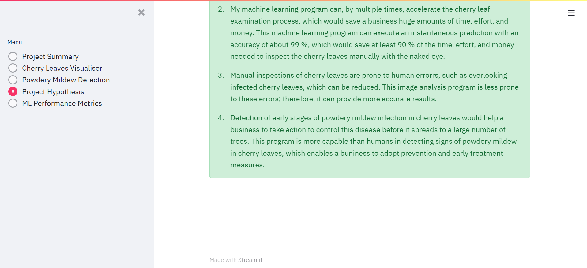
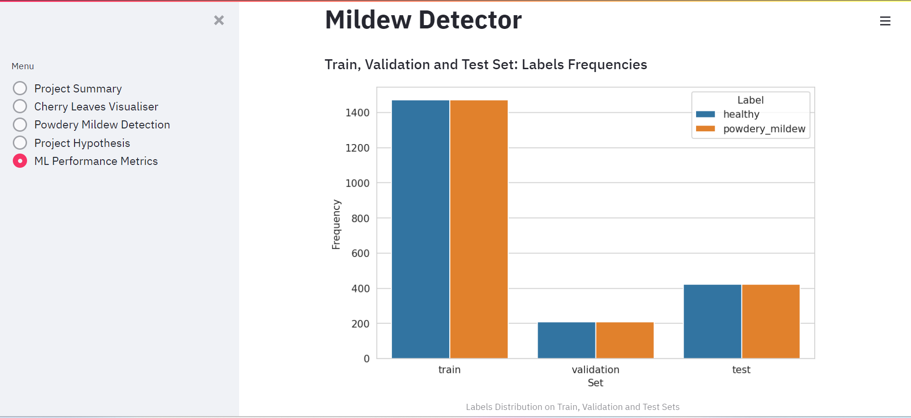
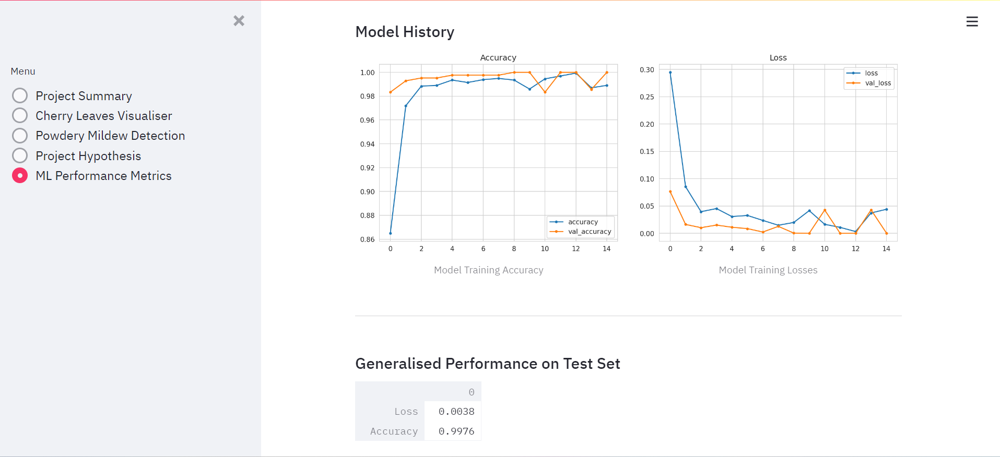

# Mildew Detector

- 'Mildew Detector' is an application that helps differentiate between healthy cherry leaves and those that are infected with powdery mildew, which is a fungal disease that can infect many plants.
- I built this application as my student fifth portfolio project at Code Institute.
- To visit this application website live on Heroku, please click on this [link](https://mildew-identifier-11888352e0e6.herokuapp.com/).
- To visit this application GitHub repository, please click on this [link](https://github.com/Majdi-Aref/mildew-detector).
- The manual detection of powdery mildew in cherry trees, which is done by examining the leaves with the naked eye, is not a feasible method because, im most cases, the total number of the cherry trees is huge.
- This project implements a modern and practical machine learning program that examines a cherry leaf image and immediately determines whether it is healthy or infected with powdery mildew.
- Businesses who grow cherry crops can profit from this application.

# 1. Dataset content

- The dataset is taken from Code Institute's account on Kaggle.
- It consists of 2104 healthy cherry leaves images and 2104 cherry leaves images that contain powdery mildew.
- The owner of this dataset is Farmy & Foods, which is a business that grows cherry crops.
- To check this dataset, please click on this [link](https://www.kaggle.com/datasets/codeinstitute/cherry-leaves).

# 2. Business requirements

## 2. 1. First business requirement

- Farmy & Foods is interested in conducting a study to visually differentiate a cherry leaf that is healthy from one that contains powdery mildew.
  - To determine whether a cherry leaf is healthy or infected with powdery mildew, Farmy & Foods is examining their cherry leaves with the naked eye, which is an arduous method that costs gigantic amounts of time and money.

## 2. 2. Second business requirement

- The customer, Farmy & Foods, is interested in predicting if a cherry leaf is healthy or contains powdery mildew.
  - This state-of-the-art project presents a machine learning program that inspects each cherry leaf and immediately predicts whether it is healthy or infected with powdery mildew, which effectively saves both time and money and perfectly meets the customer's needs.

# 3. Hypotheses and how to validate them

## 3. 1. First hypothesis and how to validate it

- Hypothesis
  - Cherry leaves that are infected with powdery mildew demonstrate unique properties that distinguish them from other ones that are healthy; those unique properties are small white, milky, or light gray spots that my machine learning program can detect.
- Validation
  - By implementing a binary classification method, my machine learning program has been able to detect those unique properties and utilize them to accurately predict whether a cherry leaf is healthy or infected with powdery mildew.

## 3. 2. Second hypothesis and how to validate it

- Hypothesis
  - My machine learning program can, by multiple times, accelerate the cherry leaf examination process, which would save a business huge amounts of time, effort, and money.
- Validation
  - This machine learning program can execute an instantaneous prediction with an accuracy of about 99%, which would save at least 90% of the time, effort, and money needed to inspect the cherry leaves manually with the naked eye.

## 3. 3. Third hypothesis and how to validate it

- Hypothesis
  - Manual inspections of cherry leaves are prone to human errorrs, such as overlooking infected cherry leaves, which can be reduced.
- Validation
  - This image analysis program is less prone to these errors; therefore it can provide more accurate results.

## 3. 4. Fourth hypothesis and how to validate it

- Hypothesis
  - Detection of early stages of powdery mildew infection in cherry leaves would help a business to take action to control this disease before it spreads to a large number of trees.
    Validation
  - This program is more capable than humans in detecting signs of powdery mildew in cherry leaves, which enables a buniness to adopt prevention and early treatment measures.

# 4. Rationale to map the business requirements to the data visualizations and machine learning tasks

## 4. 1. First business requirement

- As a user, I want to display the mean and standard deviation of images of healthy cherry leaves and of cherry leaves that contain powdery mildew so that I can optically distinguish between them.
- As a user, I want to display the difference between an average infected cherry leaf image and an average healthy cherry leaf image.
- As a user, I want to display an image montage for images of cherry leaves that are healthy and also of cherry leaves that contain powdery mildew.

## 4. 2. Second business requirement

- As a user, I want to predict if a cherry leaf is healthy or contains powdery mildew.
- As a user, I want to upload cherry leaves images into the machine learning predicting program.
- As a user, I want to download the analysis report of each prediction.

# 5. ML business case

- The target of this project is to develop a machine learning program that both effectively and efficiently predicts if a cherry leaf is healthy or contains powdery mildew, which can save the customer time, effort, and money.
- For this purpose, This machine learning program will utilize the business' cherry leaves dataset.
  - Both healthy and infected cherry leaves images will be applied to train the machine learning model to enable it to learn the differences between the two by means of recognizing repeated patterns.
  - The machine learning model will apply binary classification prediction method to display a prediction result, which must be one of two possibilities: either "healthy" or "powdery mildew".
- To make predictions, the customer wants an easy-to-use dashboard to upload both old cherry leaves images from the dataset and also new cherry leaves images that were not included in the project dataset.
- The customer wants a prediction accuracy to be at least 97% as to whether a cherry leaf is healthy or contains powdery mildew.
- Only persons who are related to developing this project may have access to the business' cherry leaves dataset.
- This program could be exploited to detect similar or different diseases that affect crops other than the cherry tree.

# 6. Agile

- I created a project on this application GitHub repository.
- Then, I created six issues and added them to that project.
- Those six issues cover the epics and user stories of this application.
- Five of the those six issues were classified as 'Must have' and one issue was classified as 'Should have'.
- I accomplished the five 'Must have' issues, so they are in the 'Done' category of the GitHub project.
- However, I could not accomplish the 'Should have' issue, so it is in the 'Todo' category of the GitHub project.

# 7. Dashboard design

## 7. 1. Project summary page

- This page gives general information about the project, states the owner of the cherry leaves images dataset, and clarifies the project business requirements.

## 7. 2. Cherry leaves visualizer page

- This page shows images of! average and variability cherry leaves images.
- It also displays images of the average infected and the average healthy cherry leaves images.
- It also enables a user to create an image monCherry leaves visualizer the r the infected ccherry-leaves-visualizeres.

## 7. 3. Powdery mildew detection page

- This page includes a link to the cherry leaves images dataset on Kaggle; a user can visit this link and download images from that dataset to make predictions.
- It also includes an uploader that a user can use to to upload cherry leaves images and make predictions.
- It shows the uploaded image and the result of its prediction with a respective plot.
- It contains a report of the uploaded images and their respective prediction results that a user can download.

## 7. 4. Project hypothesis page

- This page details the project hypotheses and their validations.

## 7. 5. ML performance metrics page

- This page displays the frequency of each label in the train, validation, and test sets.
- It also contains a plot that illustrates the machine learning model training accuracy and losses.

# 8. Unfixed bugs

- This project does not include unfixed bugs.

# 9. Deployment

## 9. 1. On Github

- I forked the Code Institute's Github template repository "milestone-project-mildew-detection-in-cherry-leaves" into my Github account.
- Please know that this Code Institute's Github template repository is designed to be utilized on Codeanywhere.
- By applying my forked Code Institute' template repository, I created a Codeanywhere workspace to build this project.
- To visit the project GitHub repository, please click on this [link](https://github.com/Majdi-Aref/mildew-detector).

## 9. 2. On Codeanywhere

- Log into your account on Codeanywhere.
- Click on the button 'New Workspace'.
- Copy the URL of the Github repository that you have just forked into your Github account and paste it in the 'Repository URL' field.
- Click on the 'Create' button.
- Wait for the workspace to open.
- In your newly created Codeanywhere workspace, open a new terminal.
- In that terminal, type in the command 'pip3 install -r requirements.txt', which will automatically install all the necessary programs listed in your requirements.txt file.
- In the terminal, type in the command 'pip3 install jupyter' to install Jupyter Notebook into your Codeanywhere workspace.
- In the terminal, type in the command "jupyter notebook --NotebookApp.token=''" to open your Jupyter server.
- In your Codeanywhere workspace, open port 8888 preview or browser.
- Open the Jupyter Notebooks directory in the jupyter webpage that has opened and click on the notebook you want to open, then click the button 'Not Trusted' and choose 'Trust'.
- Note that the kernel of your Jupyter Notebooks says 'Python 3'. It inherits from your Codeanywhere workspace so it will be Python-3.8.12 as installed by the Code Institute's template. To confirm this you can type in the command '! python --version' in a Jupyter notebook code cell or in your Codeanywhere terminal.

## 9. 3. on Heroku

- Log into your Heroku account and go to 'Account Settings' in the menu under your avatar.
- Scroll down to the 'API Key' and click 'Reveal'.
- Copy that API key.
- In a Codeanywhere terminal, run the command 'heroku_config'.
- You will be asked to paste in your API key in that Codeanywhere terminal.
- You can now use the Heroku CLI program. To confirm that it is working, try running the command 'heroku apps' in your Codeanywhere terminal.
- This Heroku API key is unique and private to you, so do not share it. If you accidentally make it public then you can create a new one by clicking on 'Regenerate API Key...', which is under your API key.
- Create an new app on your Heroku account for your project.
- From your Codeanywhere terminal, Log into Heroku CLI using the command 'heroku login -i' and enter your credentials.
- If a Heroku error appears telling you that the Python version is not available, it may be due to the Heroku's stack used for the application.
- To fix this, from your Codeanywhere terminal, log in to the Heroku command line interface, CLI, and type in the command 'heroku stack:set heroku-20' to set the stack to Heroku-20.
- Go to your Heroku app, click on 'Deploy' on the navigation bar.
- On the 'Deploy' page, scroll down until you find the 'Deployment method' on the left.
- Select GitHub as the deployment method.
- Type in your repository name and click on 'Search'. Once it is found, click on 'Connect'.
- Choose 'main' as the branch to deploy, then click on 'Deploy Branch'.
- Once your app is deployed, click on 'Open app' on the top right of your Heroku app page.
- To visit this project live, please click on this [link](https://mildew-identifier-11888352e0e6.herokuapp.com/).

# 10. Technologies

## 10. 1. Main data analysis and machine learning libraries

- NumPy
  - A fundamental library for scientific computing in Python.
  - It provides a high-performance multidimensional array object and a comprehensive suite of mathematical functions for working with these arrays.
- Pandas
  - A powerful Python library that simplifies data manipulation and analysis.
  - It enables users to efficiently work with tabular data structures like Series and DataFrames.
- Matplotlib
  - A veratile Python library for generating high-quality visualizations.
  - It provides a wide range of data types and plot styles, from simple line charts to complex interactive maps.
- Seaborn
  - A Python data visualization library that builds on top of Matplotlib.
  - It provides an easy-to-use interface for creating informative and aesthetically pleasing statistical graphics.
  - Its elegant syntax and built-in themes simplify the process of creating common visualizations like scatter plots, histograms, box plots, and correlation matrices.
- Plotly
  - An interactive, open-source graphing library for Python that enables users to create a wide range of visualizations, from simple line charts to complex 3D graphs.
  - Its interactive features allow users to zoom, hover, and pan across the graphs, enhancing the overall data exploration experience.
- TensorFlow
  - A powerful open-source machine learning library that simplifies the process of building and training neural networks.
  - It excels in tasks like image recognition, natural language processing, and speech recognition.
- Keras
  - A high-level open-source neural network API, written in Python and capable of running on top of TensorFlow, JAX, or PyTorch.
  - It is designed to be user-friendly and easy to learn, enabling developers to quickly build and train neural networks for a variety of tasks, including image classification, natural language processing, and speech recognition.
- Scikit-learn
  - A powerful open-source machine learning library for Python.
  - It offers a wide range of algorithms and tools for both supervised and unsupervised learning tasks.
  - It simplifies the process of data preprocessing, model selection, model evaluation, and deployment, making it an essential tool for data scientists and machine learning practitioners.
- Joblib
  - A Python library that provides tools for efficient parallel processing, caching, and serialization of Python objects.
  - It is commonly used for tasks such as speeding up machine learning model training, saving and loading large datasets, and distributing computational workloads across multiple machines.
- Pillow
  - A free and open-source Python library for working with images.
  - It supports a wide variety of image formats, including JPEG, PNG, TIFF, GIF, and BMP.
  - Pillow allows you to open, modify, and save images, as well as create new images from scratch.
  - It also provides a variety of image processing tools, such as resizing, cropping, rotating, and filtering.

## 10. 2. Version control

- GitHub
  - A cloud-based hosting service for Git repositories, which is a distributed version control system.
  - It allows developers to store, manage, and track changes to their code, and collaborate with others on projects.

## 10. 3. Development and Hosting

- Jupyter
  - A web-based interactive computational environment that allows you to combine code, text, and images in a single document.
  - It is a popular tool for data science, machine learning, and other scientific computing tasks.
- Codeanywhere
  - A cloud-based integrated development environment, IDE, that allows you to write, edit, and run code from any web browser.
  - It supports a wide variety of programming languages and frameworks, and it also includes features such as syntax highlighting, code completion, debugging, and version control.
- Streamlit
  - An open-source Python library that simplifies the process of building and deploying data-driven web applications.
  - It provides a high-level API that allows you to create dashboards, interactive visualizations, and machine learning models without writing any front-end code.
- Heroku
  - A cloud Platform as a Service, PaaS, that allows developers to deploy, manage, and scale their applications without having to worry about infrastructure.
- Kaggle
  - A renowned online community and platform for data science enthusiasts and professionals to sharpen their skills, collaborate on projects, and compete in machine learning challenges.
  - It provides a vast repository of datasets, a supportive community, and a series of competitions that foster learning and innovation in the data science realm.

# 11. Credits

- [Github template repository of Code Institute's predictive analytics milestone project: Mildew Detection in Cherry Leaves](https://github.com/Code-Institute-Solutions/milestone-project-mildew-detection-in-cherry-leaves)
- [Code Institute's videos and GitHub repository of the predictive analytics walkthrough project 01: Malaria Detector](https://github.com/Code-Institute-Solutions/WalkthroughProject01)
- [Code Institute's Kaggle cherry leaves dataset](https://www.kaggle.com/datasets/codeinstitute/cherry-leaves)
