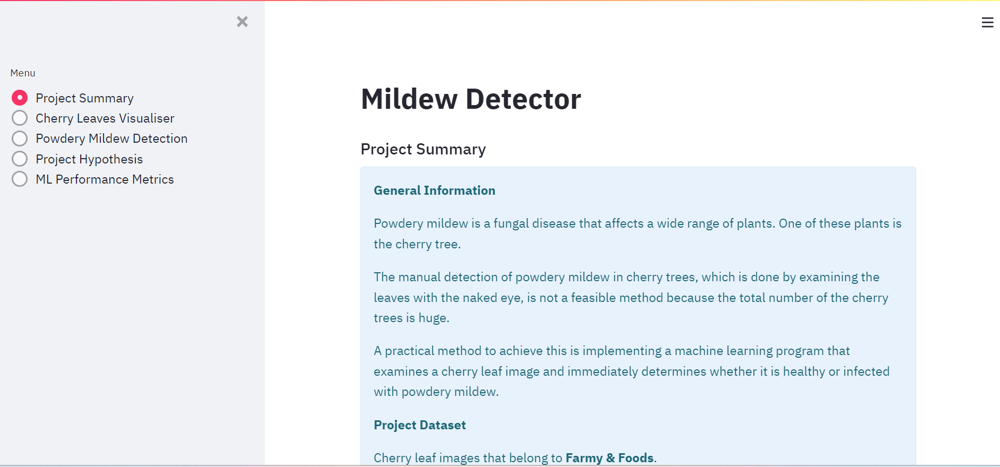
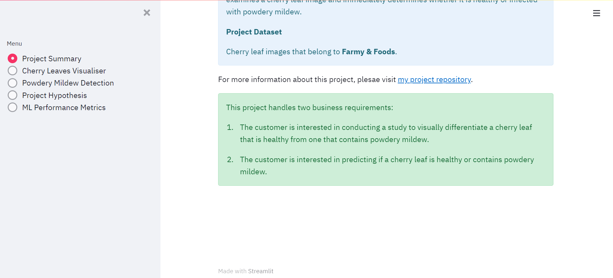
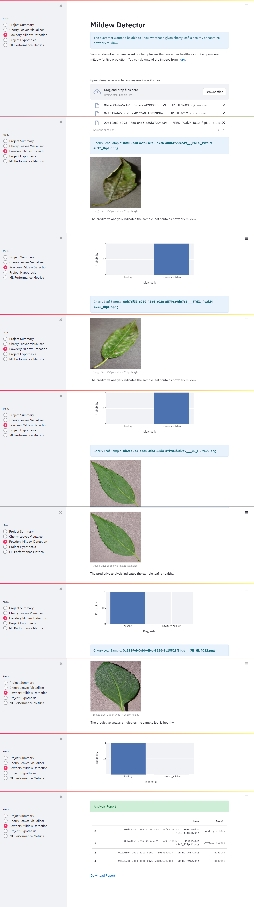

# Mildew Detector

- 'Mildew Detector' is an application that helps differentiate between healthy cherry leaves and those that are infected with powdery mildew, which is a fungal disease that can infect many plants.

- I built this app as my fifth portfolio project at Code Institute.

- The manual detection of powdery mildew in cherry trees, which is done by examining the leaves with the naked eye, is not a feasible method because, im most cases, the total number of the cherry trees is huge.

- This project implements a modern and practical machine learning program that examines a cherry leaf image and immediately determines whether it is healthy or infected with powdery mildew.

- Businesses who grow cherry trees can profit from this project.

# Table of contents

# 1. Dataset content

- The dataset is taken from Code Institute's account on Kaggle.
- It consists of 2104 healthy cherry leaves images and 2104 cherry leaves images that contain powdery mildew.
- The owner of this dataset is Farmy & Foods, which is a business that grows cherry crops.

# 2. Business requirements

## 2. 1. First business requirement

- Farmy & Foods is interested in conducting a study to visually differentiate a cherry leaf that is healthy from one that contains powdery mildew.
  - To determine whether a cherry leaf is healthy or infected with powdery mildew, Farmy & Foods is examining their cherry leaves with the naked eye, which is an arduous method that costs gigantic amounts of time and money.

## 2. 2. Second business requirement

- The customer, Farmy & Foods, is interested in predicting if a cherry leaf is healthy or contains powdery mildew.
  - This state-of-the-art project presents a machine learning program that inspects each cherry leaf and immediately predicts whether it is healthy or infected with powdery mildew, which effectively saves both time and money and perfectly meets the customer's needs.

# 3. Hypotheses and how to validate them

## 3. 1. First hypothesis and how to validate it

- Hypothesis
  - Cherry leaves that are infected with powdery mildew demonstrate unique properties that distinguish them from other ones that are healthy; those unique properties are small white, milky, or light gray spots that my machine learning program can detect.
- Validation
  - By implementing a binary classification method, my machine learning program has been able to detect those unique properties and utilize them to accurately predict whether a cherry leaf is healthy or infected with powdery mildew.

## 3. 2. Second hypothesis and how to validate it

- Hypothesis
  - My machine learning program can, by multiple times, accelerate the cherry leaf examination process, which would save a business huge amounts of time, effort, and money.
- Validation
  - This machine learning program can execute an instantaneous prediction with an accuracy of about 99%, which would save at least 90% of the time, effort, and money needed to inspect the cherry leaves manually with the naked eye.

## 3. 3. Third hypothesis and how to validate it

- Hypothesis
  - Manual inspections of cherry leaves are prone to human errorrs, such as overlooking infected cherry leaves, which can be reduced.
- Validation
  - This image analysis program is less prone to these errors; therefore it can provide more accurate results.

## 3. 4. Fourth hypothesis and how to validate it

- Hypothesis
  - Detection of early stages of powdery mildew infection in cherry leaves would help a business to take action to control this disease before it spreads to a large number of trees.
Validation
  - This program is more capable than humans in detecting signs of powdery mildew in cherry leaves, which enables a buniness to adopt prevention and early treatment measures.

# 4. Rationale to map the business requirements to the data visualizations and machine learning tasks

## 4. 1. First business requirement

- As a user, I want to display the mean and standard deviation of images of healthy cherry leaves and of cherry leaves that contain powdery mildew so that I can optically distinguish between them.
- As a user, I want to display the difference between an average infected cherry leaf image and an average healthy cherry leaf image.
- As a user, I want to display an image montage for images of cherry leaves that are healthy and also of cherry leaves that contain powdery mildew.

## 4. 2. Second business requirement

- As a user, I want to predict if a cherry leaf is healthy or contains powdery mildew.
- As a user, I want to upload cherry leaves images into the machine learning predicting program.
- As a user, I want to download the analysis report of each prediction.

# 5. ML business case

- The target of this project is to develop a machine learning program that both effectively and efficiently predicts if a cherry leaf is healthy or contains powdery mildew, which can save the customer time, effort, and money.
- For this purpose, This machine learning program will utilize the business' cherry leaves dataset.
  - Both healthy and infected cherry leaves images will be applied to train the machine learning model to enable it to learn the differences between the two by means of recognizing repeated patterns.
  - The machine learning model will apply binary classification prediction method to display a prediction result, which must be one of two possibilities: either "healthy" or "powdery mildew".
- To make predictions, the customer wants an easy-to-use dashboard to upload both old cherry leaves images from the dataset and also new cherry leaves images that were not included in the project dataset.
- The customer wants a prediction accuracy to be at least 97% as to whether a cherry leaf is healthy or contains powdery mildew.
- Only persons who are related to developing this project may have access to the business' cherry leaves dataset.
- This program could be exploited to detect similar or different diseases that affect crops other than the cherry tree.

# 6. Dashboard design

## 6. 1. Project summary page

- This page gives general information about the project, states the owner of the cherry leaves images dataset, and clarifies the project business requirements.

## 6. 2. Cherry leaves visualizer page

- This page shows images of! average and variability cherry leaves images.
- It also displays images of the average infected and the average healthy cherry leaves images.
- It also enables a user to create an image monCherry leaves visualizer the r the infected ccherry-leaves-visualizeres.

## 6. 3. Powdery mildew detection page

- This page includes a link to the cherry leaves images dataset on Kaggle; a user can visit this link and download images from that dataset to make predictions.
- It also includes an uploader that a user can use to to upload cherry leaves images and make predictions.
- It shows the uploaded image and the result of its prediction with a respective plot.
- It contains a report of the uploaded images and their respective prediction results that a user can download.

